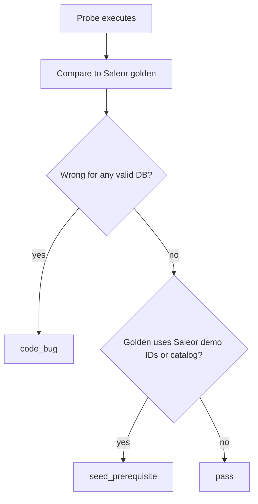

# Saleor compatibility — test improvement report

**Audience:** External compat runner / QA team replaying Saleor 3.23.7 golden probes against Basmalahub Commerce.

**Related docs:**

- [`report.md`](../report.md) — raw runner output (paste after each pass)
- [`SALEOR_GAPS.md`](SALEOR_GAPS.md) — certification policy and intentional gaps
- [`development.md`](development.md) — local setup and verification commands

---

## 1. Purpose

This report explains **why some probes fail even when the API is correct**, and how the runner should classify, seed, and score them.

The compat system replays **fixed GraphQL documents** and compares responses to **golden JSON recorded from Saleor’s demo database**. Basmalahub uses a **harness seed** (`just dev-seed`) — platform admin + demo merchant — not Saleor’s full demo catalog. When golden expects Saleor-specific entity IDs or demo rows, **shape_drift is a fixture gap**, not an API bug.

---

## 2. Current baseline (last `report.md`)

| Metric | Value |
|--------|-------|
| Compatibility score | **~96.6%** raw (818/854 before setup fixes); **effective score** excludes `data_prerequisite` + `seed_prerequisite` |
| Incompatible probes | 17 |
| Runner failure category | All 17 labeled `real_bug` |
| Tier 2 informational | 1 (`productmediabyid` error path alias) |

**After API code fixes in this repo** (see section 7), re-run the runner and apply migrations (`just reset-db` or `just migrate`). Expected score: **~99%+** with **8 seed-dependent** failures unless Saleor demo data is seeded.

---

## 3. Failure taxonomy (recommended for runner)

| Category | Meaning | Action |
|----------|---------|--------|
| `code_bug` | Response wrong for **any** valid DB state (validation, SQL, resolver logic) | Fail certification; file API issue |
| `seed_prerequisite` | API returns valid data for **harness DB**; golden assumes **Saleor demo DB** | Tag probe; exclude from score unless seed phase ran |
| `tier2_info` | Tier 1 semantic pass; optional path/code field drift | Informational only |
| `deprecated` | Saleor-deprecated operation | Exclude from denominator |



**Do not label `seed_prerequisite` probes as `real_bug`.** They block certification only when the runner claims “full Saleor demo parity” without seeding that demo.

---

## 4. Pre-run checklist (target API host)

Before a full compat pass:

1. **Harness stack:** `just up` (Saleor + harness). For official baseline: `just fresh` (populatedb).
2. **Seed profile:** `DEMO_SEED_PROFILE=saleor_demo` (default) — catalog mutations + storefront session preamble run automatically at test-run start.
3. **Auth:**
   - **Dashboard CLIENT_BUNDLE probes:** staff JWT from run credentials.
   - **Storefront `sf-*` probes:** customer JWT for account bundles; anonymous for checkout bundles (after preamble creates checkout).
4. **Failure taxonomy:** `data_prerequisite` = empty catalog / checkout session; `seed_prerequisite` = populatedb Relay ID drift; `real_bug` = API parity after setup.
5. **Scenario goldens:** After adding checkout-lifecycle steps, run `just patch-corpus --scenarios checkout-lifecycle` on official Saleor.

Legacy Basmalahub-specific steps (if testing that backend): database reset, `just dev-seed`, etc. — see [`development.md`](development.md).

---

## 5. Seed-dependent probes (8) — detailed findings

### 5.1 `_searchcustomersoperands`

| Field | Detail |
|-------|--------|
| Kind | CLIENT_BUNDLE |
| Match | shape_drift |
| Root cause | Golden assumes Saleor’s default customer list; request does **not** pass `customersIds`. |

**Request variables:** `{ "first": 10 }` only — `customersIds` omitted.

**Golden expects:** 10 demo customers (e.g. `ashley.cook@example.com`, `VXNlcjo3`, …).

**Basmalahub actual:** 2 harness customers (`harness-reference-customer@example.com`, `harness-storefront-customer@example.com`).

**Seed required:**

- Create ~10+ customers with Saleor demo emails/names **or**
- Accept harness customer set when `customersIds` is omitted.

**Runner improvements:**

- Tag: `requires_saleor_demo_seed`
- If `variables.customersIds` is absent and DB is harness-only → classify `seed_prerequisite`, not `real_bug`
- Alternatively: always pass explicit `customersIds` from a dynamic create phase

---

### 5.2 `channeldiagnostics`

| Field | Detail |
|-------|--------|
| Kind | CLIENT_BUNDLE |
| Match | shape_drift (6 field paths) |
| Root cause | Golden expects Saleor multi-channel + multi-warehouse + shipping zone graph. |

**Golden highlights:**

- `shop.id`: `U2hvcDox`, `useLegacyShippingZoneStockAvailability: true`
- Channels: **Channel-PLN** (`channel-pln`, PLN) and **Channel-USD** (`default-channel`, USD)
- Each channel: 7+ warehouses (Default, Europe, Oceania, Asia, Americas, Africa, …)
- Shipping zones: Default, Europe, … with channel/warehouse/country links

**Basmalahub actual:**

- `shop.id`: `U2hvcA==`, `useLegacyShippingZoneStockAvailability: false`
- Multiple harness channels (`default`, harness UUID slugs), **empty warehouses**, single default shipping zone

**Seed required:**

- Two channels with slugs `default-channel` and `channel-pln`
- Named warehouses with Saleor-style UUID relay IDs (or update golden to harness IDs)
- Shipping zones wired to channels and warehouses

**Runner improvements:**

- Bundle seed step: `saleor_demo_channels_and_warehouses`
- Exclude from certification score when seed step skipped

---

### 5.3 `channels`

| Field | Detail |
|-------|--------|
| Kind | CLIENT_BUNDLE |
| Match | shape_drift (4 field paths) |
| Root cause | Same as `channeldiagnostics` plus channel settings fragments. |

**Golden highlights:**

- Channel-PLN: `defaultCountry` PL, `allocationStrategy: PRIORITIZE_SORTING_ORDER`, `hasOrders: true`, 7 warehouses
- Channel-USD: `PRIORITIZE_HIGH_STOCK`, `hasOrders: true`, order/payment/checkout settings

**Basmalahub actual:**

- Harness channels; `hasOrders: false`; empty `warehouses`; `PRIORITIZE_SORT_ORDER` allocation

**Seed required:** Same bundle as §5.2.

**Runner improvements:** Share seed with `channeldiagnostics`; single `seed_prerequisite` tag for both.

---

### 5.4 `orderfulfilldata`

| Field | Detail |
|-------|--------|
| Kind | CLIENT_BUNDLE |
| Match | shape_drift (28 field paths) |
| Root cause | Order not found — golden order graph missing from harness DB. |

**Request variables:** `orderId` relay ID (runner may map to Saleor UUID).

**Golden expects:** Order `Order:d69e6ad3-2031-4c87-9cc2-5c430ea7a3bf` with:

- Fulfillable lines (e.g. “Blue Plumsolls”), allocations, stock per warehouse
- `deliveryMethod` shipping method, `isPaid: false`, etc.

**Basmalahub actual:** `{ "data": { "order": null } }`

**Seed required:**

- Full order fixture: order row, lines, variant/stock allocations, shipping method, channel
- Fixed relay IDs matching golden **or** runner rebinds variables to created order

**Runner improvements:**

- Scenario preamble: `create_fulfillable_order` → pass returned `orderId` into variables
- Tag: `requires_order_fixture_d69e6ad3`

---

### 5.5 `orderrefunddata`

| Field | Detail |
|-------|--------|
| Kind | CLIENT_BUNDLE |
| Match | shape_drift |
| Root cause | Same order family as `orderfulfilldata` + refundable payment/transaction state. |

**Seed required:** Order `d69e6ad3-…` with payment/transaction rows suitable for refund UI.

**Runner improvements:** Reuse order seed phase from §5.4; extend with payment capture state if golden requires it.

---

### 5.6 `ordertransactionsdata`

| Field | Detail |
|-------|--------|
| Kind | CLIENT_BUNDLE |
| Match | shape_drift |
| Root cause | Same order + transaction event history as Saleor demo. |

**Golden expects:** Transaction events (`AUTHORIZATION_SUCCESS`, `AUTHORIZATION_REQUEST`, amounts, PSP references).

**Basmalahub actual:** `{ "data": { "order": null } }`

**Seed required:** Order fixture + `transactions` / `transactionEvents` matching golden.

**Runner improvements:** Same order seed bundle; tag with `ordertransactionsdata`.

---

### 5.7 `searchordervariant`

| Field | Detail |
|-------|--------|
| Kind | CLIENT_BUNDLE |
| Match | shape_drift (7 field paths) |
| Root cause | Golden expects **empty** product search; harness DB has matching unpublished products. |

**Request:** `filter: { search, isPublished: false }`, `channel: "default"`.

**Golden expects:** `search.edges: []`

**Basmalahub actual:** Multiple harness products matching search string (with empty `variants`).

**Seed / logic options:**

- **Option A (seed):** Do not create harness products that match this search string before probe
- **Option B (runner):** Compare against dynamic golden from empty search on target DB
- **Option C (API):** After listing-default fixes, unpublished harness products may still appear for **staff** search with `isPublished: false` — runner should document auth context

**Runner improvements:**

- Record whether probe runs as staff vs storefront
- If golden is “no rows”, ensure preamble did not create searchable products **or** accept non-empty harness response as `seed_prerequisite`

---

### 5.8 `productvariantsetdefault`

| Field | Detail |
|-------|--------|
| Kind | CLIENT_BUNDLE |
| Match | mismatch (business_error vs success) |
| Root cause | Variant not on product — golden IDs not present in harness DB. |

**Request variables:** `productId: UHJvZHVjdDoy`, `variantId: UHJvZHVjdFZhcmlhbnQ6Mzg0`

**Golden expects:** Success with `product.id: UHJvZHVjdDoxNTI=` (Product:152), `defaultVariant: ProductVariant:384`

**Basmalahub actual:** `NOT_FOUND` — `variant not found on product`

**Seed required:**

- Product internal id **152** with variant **384** linked
- **Or** runner creates product+variant dynamically and updates golden / variables consistently

**Runner improvements:**

- Tag: `requires_product_152_variant_384`
- Prefer dynamic create → use returned relay IDs in variables and compare to dynamic golden

---

## 6. Scoring recommendations

1. **Split denominators:**
   - **Code certification:** 836 − deprecated − `seed_prerequisite` (when seed skipped)
   - **Full Saleor demo parity:** 836 − deprecated (requires demo seed phase)

2. **Reclassify failures** in runner output:
   - Map section 5 probes → `seed_prerequisite` / `data-dependent`
   - Reserve `real_bug` for section 7 regressions and new code gaps

3. **Expected scores after API fixes + harness DB:**
   - Code certification: **~99%+** (8 seed gaps)
   - Full demo parity: **100%** only after Saleor demo seed phase

4. **Tier 2:** `productmediabyid` — error path should use field alias `mainImage` (fixed in API); keep as informational unless Tier 2 is gating.

---

## 7. Code fixes landed (re-verify on next run)

These **should pass** after redeploy + migration reset. If still failing, treat as `code_bug`:

| Probe | Fix summary |
|-------|-------------|
| `transactionEventReport` | Correct `type` enum validation golden |
| `transactionInitialize` | Correct `paymentGateway` coercion golden |
| `productCreate__missing_productType` | Saleor-style partial input message |
| `productCreate__blank_name` | `ProductCreateInput!` variable message |
| `product-lifecycle/06_list_after_delete` | Silent `null` for deleted Product relay ID |
| `useravatardelete` | Staff `user { id, avatar: null }` |
| `sf-homepageproducts` | Category `background_image_url` columns |
| `sf-searchresults` | Storefront search visibility for unpublished listings |
| `sitesettings` | Country names `Bolivia`, `Brunei` |
| `productmediabyid` | Error path uses `mainImage` alias (Tier 2) |

---

## 8. Suggested runner metadata (optional)

Add per-probe tags in the runner manifest:

```yaml
# Example
_searchcustomersoperands:
  tags: [requires_saleor_demo_seed, customers]
channeldiagnostics:
  tags: [requires_saleor_demo_seed, channels, warehouses]
channels:
  tags: [requires_saleor_demo_seed, channels]
orderfulfilldata:
  tags: [requires_order_fixture_d69e6ad3]
orderrefunddata:
  tags: [requires_order_fixture_d69e6ad3]
ordertransactionsdata:
  tags: [requires_order_fixture_d69e6ad3]
searchordervariant:
  tags: [requires_harness_isolation, search]
productvariantsetdefault:
  tags: [requires_product_152_variant_384]
```

Runner logic:

```text
if probe.tags includes requires_saleor_demo_seed and not context.saleor_demo_seeded:
  category = seed_prerequisite
  exclude_from_code_certification = true
```

---

## 9. Quick reference — seed vs code

| Probe | Needs Saleor demo DB? | Needs dynamic create preamble? |
|-------|----------------------|------------------------------|
| `_searchcustomersoperands` | Yes (customers) | Or pass `customersIds` |
| `channeldiagnostics` | Yes (channels/warehouses/zones) | Possible via API mutations |
| `channels` | Yes (same) | Same |
| `orderfulfilldata` | Yes (order graph) | Recommended |
| `orderrefunddata` | Yes (order + payments) | Recommended |
| `ordertransactionsdata` | Yes (order + transactions) | Recommended |
| `searchordervariant` | Harness isolation | Control product create order |
| `productvariantsetdefault` | Yes (Product 152 / Variant 384) | Recommended |

---

## 10. Contact / updates

- Refresh this document when [`report.md`](../report.md) baseline changes.
- API team updates [`SALEOR_GAPS.md`](SALEOR_GAPS.md) when certification policy changes.
- Questions about harness auth: see `DEMO_MERCHANT_*` and `PLATFORM_ADMIN_*` in [`.env.example`](../.env.example).
