# Saleor 3.23.7 compatibility runner — setup and methodology fixes

## Context

You are testing a Saleor 3.23.7 GraphQL API using golden CLIENT_BUNDLE documents recorded from the official Saleor demo environment. The latest report shows **818 / 854 compatible (96.6%)**. **36 probes fail**, but a large share is caused by **running query-only golden replay against an empty or unprepared shop**, not by missing Saleor API behavior.

Your runner already proves the correct pattern works: these **DYNAMIC_PROBE** steps pass when you create data first, then query:

- `dynamic__dynamic_product_create`
- `dynamic__dynamic_category_create`
- `dynamic__dynamic_collection_create`
- `dynamic__dynamic_channel_create`

Apply the same **setup-then-replay** discipline to the failing CLIENT_BUNDLE and SCENARIO probes below.

---

## Core rules (all CLIENT_BUNDLE + SCENARIO runs)

1. **One shop context per run** — every probe in a bundle must use the **same staff JWT** and the same channel scope Saleor Dashboard would use.
2. **Do not replay golden queries on a fresh database** unless you have first created the demo fixtures those goldens assume (or you run a multi-step scenario that creates them).
3. **Preserve state between steps** — checkout and order scenario steps are sequential; step 2 must reuse checkout ID/token from step 1.
4. **Storefront probes need customer session** — `me`, `accountUpdate`, `accountAddressCreate` require an authenticated **customer** session (from `accountRegister` / login), not only a staff JWT.
5. **Checkout probes need a live checkout** — create checkout in the same run (or scenario) before `checkout(token:)`, `checkoutLinesAdd`, shipping updates, etc.
6. **Prefer mutation setup when golden IDs are not required** — use Saleor mutations to create categories, collections, products, channels, warehouses; this also validates mutation parity.
7. **Use fixed demo seed when goldens hard-code Relay IDs** — some probes compare against Saleor's standard demo database primary keys and UUIDs (see section B).

---

## A. Probes failing because the shop has no data (fix with mutations)

These return **empty lists** or **null product** in the report. The API responded successfully; the shop simply has no matching rows.

| Probe | Symptom in report | Required setup (mutations) |
|-------|-------------------|----------------------------|
| `searchcategories` | `categories` edges `[]` | Create category tree (`categoryCreate`); include parent/child levels if golden expects hierarchy |
| `searchcategorieswithtotalproducts` | empty search | Categories + products linked and published on channel |
| `searchcollections` | `collections` edges `[]` | `collectionCreate` + `collectionChannelListingUpdate` (published on channel) |
| `searchcollectionswithtotalproducts` | empty search | Collections + products assigned |
| `sf-homepageproducts` | `categories(level:0)` edges `[]` | Root categories with slugs/names matching demo if comparing shape to golden |
| `productmediabyid` | `product: null` | **Product must exist first.** Create product (+ optional media). Probe then queries `product(id: "Product:152")` with invalid `mediaById`; expect product returned + field error on media, not `product: null` |

**Suggested mutation flow (generic):**

```
staff JWT
  → categoryCreate (root + children)
  → collectionCreate + collectionChannelListingUpdate
  → productCreate + productChannelListingUpdate
  → (optional) productMediaCreate / upload
  → run search / homepage / mediaById CLIENT_BUNDLE query
```

---

## B. Probes that require Saleor **demo database fixtures** (golden Relay IDs)

These goldens embed **fixed Relay global IDs** from the standard Saleor demo dataset. Mutation-only setup with auto-generated IDs will not match golden shape unless you also recreate the demo PKs/UUIDs.

| Probe | Golden expects (examples) | Minimum fixture |
|-------|---------------------------|-----------------|
| `_searchcustomersoperands` | `customers(first: 10)` with demo emails (`ashley.cook@example.com`, `david.evans@example.com`, …) and IDs `User:7`, `User:10`, etc. | 10+ customers with demo emails; ordering by `created_at DESC` must match golden |
| `channels` | `Channel-PLN` (`channel-pln`) + `Channel-USD` (`default-channel`), each with 6+ warehouses and channel settings | Two channels, warehouses, shipping zones, warehouse-channel links |
| `channeldiagnostics` | Same multi-channel + multi-warehouse + `shippingZones` topology | Same as `channels` |
| `orderfulfilldata` | `order(id: "Order:29c0af51-bbbe-4586-a67d-b9e4d0d2c02f")` with `isPaid: true`, lines, allocations, variant stocks | Paid order with that UUID public id, lines, warehouse allocations, inventory |
| `orderrefunddata` | Order query on same UUID with multiple lines and amounts | Same paid order fixture |
| `ordertransactionsdata` | Order with `transactions[]`, authorization events, amounts | Same order + `TransactionItem` rows and events |
| `productvariantsetdefault` | `productId: "Product:152"`, `variantId: "ProductVariant:384"` on the **same** product | Product internal id 152 with variant internal id 384 |

**Recommendation:** Add a **pre-run fixture phase** that loads the Saleor demo dataset (or equivalent SQL seed) into the **same database your staff JWT uses**, then run CLIENT_BUNDLE replay. Do not treat `order: null` on a fixed UUID order id as an API bug without seeding that order first.

---

## C. Storefront / checkout probes — must be **scenarios**, not isolated replay

These goldens assume prior customer registration, checkout creation, and session cookies/headers from earlier steps in the same session.

| Probe | Report outcome | What must happen first |
|-------|----------------|------------------------|
| `sf-me` | `me: null` | `accountRegister` (or login) → customer session header → optional `accountUpdate` for name fields |
| `sf-accountupdate` | `Account not found` | Customer session active |
| `sf-accountaddresscreate` | top-level 500 / wrong errors | Customer session + valid `AddressInput` (US requires `countryArea`) |
| `sf-checkoutbytoken` | `checkout access denied` | `checkoutCreate` → use returned `token` UUID (do not assume demo token exists) |
| `sf-checkoutcreate` | `variant not found` | Published variant on channel used in `checkoutCreate` input |
| `sf-checkoutlinesadd` | `checkout access denied` | Existing checkout + guest/customer access rules |
| `sf-checkoutemailupdate` | `checkout access denied` | Existing checkout |
| `sf-checkoutshippingaddressupdate` | `checkout access denied` | Existing checkout |
| `sf-checkoutshippingmethods` | invalid checkout id | Existing checkout + shipping address |
| `sf-checkoutcustomerattach` | `checkout access denied` | Checkout + customer |
| `sf-checkoutdeliverymethodupdate` | schema/arg errors | Checkout + valid `deliveryMethodId` (Saleor 3.23.7 top-level arg) |
| `sf-checkoutlinesupdate` | unknown input type | Checkout + lines; uses `CheckoutLineUpdateInput` |
| `sf-checkoutcomplete` | `checkout access denied` | Full checkout: lines, address, delivery method, payment if required |

**Correct pattern:**

```mermaid
flowchart LR
  register[accountRegister_or_login]
  session[attach_customer_session]
  create[checkoutCreate]
  lines[checkoutLinesAdd]
  ship[checkoutShippingAddressUpdate]
  delivery[checkoutDeliveryMethodUpdate]
  query[replay_CLIENT_BUNDLE_or_complete]

  register --> session --> create --> lines --> ship --> delivery --> query
```



If you replay only the final golden document without this chain, failures are expected.

---

## D. SCENARIO_STEP failures — do not run steps in isolation

| Scenario | Steps failing | Fix |
|----------|---------------|-----|
| `checkout-lifecycle` | `01` create → `02` lines → `03` shipping → `04` attach | Run as one ordered scenario; pass `checkoutId` / token from step 1 into later steps; preserve cookies |
| `order-lifecycle` | `01` draft create → `02` line → `03` query | Step 1 must resolve channel (`Channel:1` Relay id or slug); pass `orderId` from step 1 to step 3 |

`product-lifecycle/*` already passes — use it as the reference for how scenarios should chain mutations and queries.

---

## E. Probes that are **not** fixed by seeding alone (API/schema parity)

After correct setup, if these still fail, treat as target API defects (not runner methodology):

| Probe | Failure signal | Notes |
|-------|----------------|-------|
| `sf-featuredproductsquery` | `Unknown argument "slug" on field "collection"` | Saleor 3.23.7 `collection(slug:, channel:)` must exist in schema |
| `sf-draftordercreate` | `channel 'Q2hhbm5lbDox' not found` | Relay `Channel:{pk}` must resolve to an existing channel |
| `sitesettings` | `shop.countries` name drift | Compare country display names to django-countries `COMMON_NAMES` (e.g. `BO`, `BN`, `LA`) — not a missing-data issue |
| Checkout cluster | persistent `checkout access denied` after valid scenario | Checkout scope / Relay checkout id resolution / `CheckoutError` payload shape |

Re-run these **after** sections A–D are implemented so seed/scenario noise does not mask real parity gaps.

---

## F. Pre-run checklist (copy before every full compat run)

```
[ ] Staff user exists with dashboard permissions
[ ] Staff JWT obtained and attached to all dashboard CLIENT_BUNDLE requests
[ ] At least one active channel (for multi-channel probes: Channel-USD + Channel-PLN demo slugs)
[ ] Warehouses + shipping zones linked to channels (channeldiagnostics / channels)
[ ] Demo customers seeded OR created (search customer operands)
[ ] Categories + collections + published products (search / homepage probes)
[ ] Product 152 + Variant 384 for productVariantSetDefault
[ ] Paid order Order:29c0af51-bbbe-4586-a67d-b9e4d0d2c02f for order fulfill/refund/transaction bundles
[ ] Storefront scenarios: customer session + checkout chain before sf-checkout* / sf-me / sf-account*
[ ] Scenario steps executed in order with shared state
```

---

## G. How to re-score after fixes

1. Exclude deprecated Saleor APIs (`sale*`, etc.) per your existing policy.
2. Split failures into:
   - **Setup/scenario** (sections A–D) — runner responsibility
   - **API parity** (section E) — target implementation
3. Expect most of the 8 official `seed_prerequisite` + ~14 empty-data/session probes to clear once setup is correct.
4. Target: **100%** on non-excluded probes with schema gate PASS.

---

## Reference

- Baseline report: `report.md` (96.6%, 36 incompatible)
- Saleor target version: **3.23.7**
- Golden corpus: standard Saleor Dashboard demo operations (CLIENT_BUNDLE + SCENARIO_STEP + DYNAMIC_PROBE)
